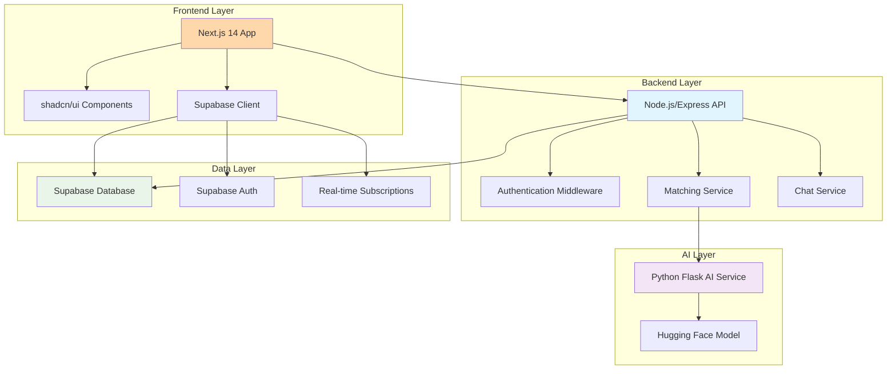

# JamMatch Design Document

## Overview

JamMatch is a full-stack musician band-matching application built with a modern microservices architecture. The system consists of three main components: a Next.js 14 frontend with shadcn/ui components, a Node.js/Express backend API, and a Python Flask AI service for compatibility analysis. The application uses Supabase for authentication and database management, providing real-time capabilities for chat and matching updates.

The core functionality revolves around intelligent musician matching using a hybrid approach that combines algorithmic scoring (location, genre overlap, experience compatibility) with AI-powered personality and compatibility analysis using the mistralai/Voxtral-Mini-3B-2507 model.

## Architecture

### System Architecture Diagram



### Technology Stack

**Frontend:**

- Next.js 14 with App Router
- TypeScript for type safety
- shadcn/ui component library
- Tailwind CSS for styling
- Supabase client for real-time features

**Backend:**

- Node.js with Express.js
- TypeScript
- Supabase JavaScript client
- JWT token validation
- RESTful API design

**AI Service:**

- Python Flask framework
- Hugging Face Transformers library
- mistralai/Voxtral-Mini-3B-2507 model
- Docker containerization
- Railway deployment ready

**Database & Auth:**

- Supabase (PostgreSQL)
- Supabase Auth
- Real-time subscriptions
- Row Level Security (RLS)

## Components and Interfaces

### Frontend Components

#### Page Components

- **LandingPage** (`/page.tsx`): Hero section, features showcase, CTA buttons
- **RegisterPage** (`/register/page.tsx`): User registration form with validation
- **LoginPage** (`/login/page.tsx`): Authentication form
- **ProfileSetupPage** (`/profile/setup/page.tsx`): Multi-step profile creation wizard
- **DashboardPage** (`/dashboard/page.tsx`): Main user interface showing matches and bands
- **ChatPage** (`/chat/[bandId]/page.tsx`): Real-time messaging interface
- **BandProfilePage** (`/band/[bandId]/page.tsx`): Band details and compatibility scores
- **SettingsPage** (`/settings/page.tsx`): Profile editing interface

#### Reusable Components

- **ProfileSetupWizard**: Multi-step form with progress indicator
- **MatchCard**: Display user compatibility with scores and reasoning
- **BandCard**: Show band information and member avatars
- **ChatMessage**: Individual message component with timestamp
- **CompatibilityScore**: Visual representation of compatibility percentage
- **InstrumentBadge**: Display user instruments as badges
- **GenreBadge**: Display musical genres as badges

#### shadcn/ui Components Used

- Button: Primary actions, form submissions
- Card: Content containers for matches, bands, profiles
- Input: Form fields for text input
- Select: Dropdown selections for genres, instruments, experience
- Avatar: User profile pictures and placeholders
- Badge: Tags for instruments, genres, status indicators
- Alert: Success/error messages and notifications
- Tabs: Navigation within profile setup and settings

### Backend API Endpoints

#### Authentication Routes (`/auth`)

- `POST /auth/register`: User registration
- `POST /auth/login`: User authentication
- `POST /auth/logout`: Session termination
- `GET /auth/me`: Get current user profile

#### User Management Routes (`/users`)

- `GET /users/profile`: Get user profile
- `PUT /users/profile`: Update user profile
- `POST /users/profile/setup`: Complete initial profile setup
- `GET /users/matches`: Get compatibility matches for user

#### Band Management Routes (`/bands`)

- `GET /bands`: Get user's bands
- `GET /bands/:id`: Get specific band details
- `POST /bands`: Create new band (automatic via matching)
- `PUT /bands/:id`: Update band information
- `GET /bands/:id/members`: Get band member details

#### Chat Routes (`/chat`)

- `GET /chat/:bandId/messages`: Get chat history
- `POST /chat/:bandId/messages`: Send new message
- `WebSocket /chat/:bandId`: Real-time message updates

#### Matching Routes (`/matching`)

- `POST /matching/calculate`: Trigger compatibility calculation
- `GET /matching/scores/:userId`: Get user's compatibility scores
- `POST /matching/ai-analysis`: Request AI compatibility analysis

### AI Service Interface

#### Flask Application Structure

```python
# Main application endpoints
@app.route('/health', methods=['GET'])
@app.route('/compatibility', methods=['POST'])
@app.route('/batch-compatibility', methods=['POST'])
```

#### Compatibility Analysis Endpoint

- **Input**: Two user profile objects with musical preferences, experience, location
- **Processing**: Uses mistralai/Voxtral-Mini-3B-2507 for personality analysis
- **Output**: Compatibility score (1-100) with detailed reasoning

#### Model Integration

- Hugging Face Transformers pipeline
- Model caching for performance
- Error handling and fallback responses
- Request validation and sanitization

## Data Models

### Database Schema

#### Users Table

```sql
CREATE TABLE users (
    id UUID PRIMARY KEY DEFAULT gen_random_uuid(),
    email TEXT UNIQUE NOT NULL,
    name TEXT NOT NULL,
    bio TEXT,
    instruments TEXT[],
    genres TEXT[],
    experience TEXT CHECK (experience IN ('beginner', 'intermediate', 'advanced', 'professional')),
    location TEXT,
    avatar_url TEXT,
    profile_completed BOOLEAN DEFAULT FALSE,
    created_at TIMESTAMP DEFAULT NOW(),
    updated_at TIMESTAMP DEFAULT NOW()
);
```

#### Bands Table

```sql
CREATE TABLE bands (
    id UUID PRIMARY KEY DEFAULT gen_random_uuid(),
    name TEXT,
    member_ids UUID[],
    status TEXT DEFAULT 'active' CHECK (status IN ('active', 'inactive', 'disbanded')),
    compatibility_data JSONB,
    formation_date TIMESTAMP DEFAULT NOW(),
    created_at TIMESTAMP DEFAULT NOW(),
    updated_at TIMESTAMP DEFAULT NOW()
);
```

#### Messages Table

```sql
CREATE TABLE messages (
    id UUID PRIMARY KEY DEFAULT gen_random_uuid(),
    band_id UUID REFERENCES bands(id) ON DELETE CASCADE,
    user_id UUID REFERENCES users(id) ON DELETE CASCADE,
    content TEXT NOT NULL,
    message_type TEXT DEFAULT 'text' CHECK (message_type IN ('text', 'system')),
    created_at TIMESTAMP DEFAULT NOW()
);
```

#### Compatibility Scores Table

```sql
CREATE TABLE compatibility_scores (
    id UUID PRIMARY KEY DEFAULT gen_random_uuid(),
    user1_id UUID REFERENCES users(id) ON DELETE CASCADE,
    user2_id UUID REFERENCES users(id) ON DELETE CASCADE,
    algorithmic_score INTEGER CHECK (algorithmic_score >= 0 AND algorithmic_score <= 100),
    ai_score INTEGER CHECK (ai_score >= 0 AND ai_score <= 100),
    final_score INTEGER CHECK (final_score >= 0 AND final_score <= 100),
    ai_reasoning TEXT,
    location_score INTEGER,
    genre_score INTEGER,
    experience_score INTEGER,
    calculated_at TIMESTAMP DEFAULT NOW(),
    UNIQUE(user1_id, user2_id)
);
```

### TypeScript Interfaces

#### User Interface

```typescript
interface User {
  id: string;
  email: string;
  name: string;
  bio?: string;
  instruments: string[];
  genres: string[];
  experience: "beginner" | "intermediate" | "advanced" | "professional";
  location: string;
  avatar_url?: string;
  profile_completed: boolean;
  created_at: string;
  updated_at: string;
}
```

#### Band Interface

```typescript
interface Band {
  id: string;
  name?: string;
  member_ids: string[];
  members?: User[];
  status: "active" | "inactive" | "disbanded";
  compatibility_data: CompatibilityData;
  formation_date: string;
  created_at: string;
  updated_at: string;
}
```

#### Compatibility Score Interface

```typescript
interface CompatibilityScore {
  id: string;
  user1_id: string;
  user2_id: string;
  algorithmic_score: number;
  ai_score?: number;
  final_score: number;
  ai_reasoning?: string;
  location_score: number;
  genre_score: number;
  experience_score: number;
  calculated_at: string;
}
```

## Error Handling

### Frontend Error Handling

- **Form Validation**: Client-side validation with shadcn/ui form components
- **API Error Responses**: Centralized error handling with toast notifications
- **Authentication Errors**: Redirect to login with appropriate messaging
- **Network Errors**: Retry mechanisms and offline state handling
- **Real-time Connection Errors**: Automatic reconnection for chat and updates

### Backend Error Handling

- **Input Validation**: Request validation middleware using Joi or similar
- **Authentication Errors**: JWT validation and proper HTTP status codes
- **Database Errors**: Transaction rollbacks and connection pool management
- **AI Service Errors**: Fallback to algorithmic scoring when AI service unavailable
- **Rate Limiting**: Prevent abuse with request rate limiting

### AI Service Error Handling

- **Model Loading Errors**: Graceful degradation and error responses
- **Input Validation**: Profile data validation before processing
- **Timeout Handling**: Request timeouts for long-running AI analysis
- **Resource Management**: Memory and GPU resource management
- **Fallback Responses**: Default compatibility analysis when model fails

### Error Response Format

```typescript
interface ErrorResponse {
  error: {
    code: string;
    message: string;
    details?: any;
    timestamp: string;
  };
}
```

## Testing Strategy

### Frontend Testing

- **Unit Tests**: Jest and React Testing Library for components
- **Integration Tests**: Test user flows and API integration
- **E2E Tests**: Playwright for critical user journeys
- **Visual Regression Tests**: Screenshot testing for UI consistency
- **Accessibility Tests**: Automated a11y testing with axe-core

### Backend Testing

- **Unit Tests**: Jest for individual functions and services
- **Integration Tests**: Supertest for API endpoint testing
- **Database Tests**: Test database operations with test database
- **Authentication Tests**: JWT token validation and middleware testing
- **Matching Algorithm Tests**: Comprehensive scoring algorithm validation

### AI Service Testing

- **Model Tests**: Validate model responses and scoring consistency
- **API Tests**: Flask endpoint testing with various input scenarios
- **Performance Tests**: Load testing for concurrent compatibility requests
- **Integration Tests**: End-to-end testing with backend API integration

### Test Data Management

- **Fixtures**: Predefined user profiles and test scenarios
- **Database Seeding**: Automated test data generation
- **Mock Services**: Mock AI service responses for consistent testing
- **Test Isolation**: Each test runs with clean database state

### Continuous Integration

- **GitHub Actions**: Automated testing on pull requests
- **Test Coverage**: Minimum 80% code coverage requirement
- **Linting**: ESLint and Prettier for code quality
- **Type Checking**: TypeScript strict mode validation
- **Security Scanning**: Automated vulnerability scanning

## Performance Considerations

### Frontend Optimization

- **Code Splitting**: Route-based code splitting with Next.js
- **Image Optimization**: Next.js Image component for avatars and assets
- **Caching**: Browser caching for static assets and API responses
- **Bundle Analysis**: Regular bundle size monitoring and optimization

### Backend Optimization

- **Database Indexing**: Proper indexes on frequently queried columns
- **Connection Pooling**: Efficient database connection management
- **Caching Layer**: Redis for frequently accessed data
- **API Rate Limiting**: Prevent abuse and ensure fair usage

### AI Service Optimization

- **Model Caching**: Keep model loaded in memory for faster responses
- **Batch Processing**: Process multiple compatibility requests together
- **Resource Management**: Efficient GPU/CPU utilization
- **Response Caching**: Cache AI analysis results for repeated requests

### Real-time Performance

- **WebSocket Optimization**: Efficient message broadcasting
- **Subscription Management**: Proper cleanup of real-time subscriptions
- **Message Queuing**: Handle high-volume chat messages efficiently
- **Connection Pooling**: Manage WebSocket connections effectively
